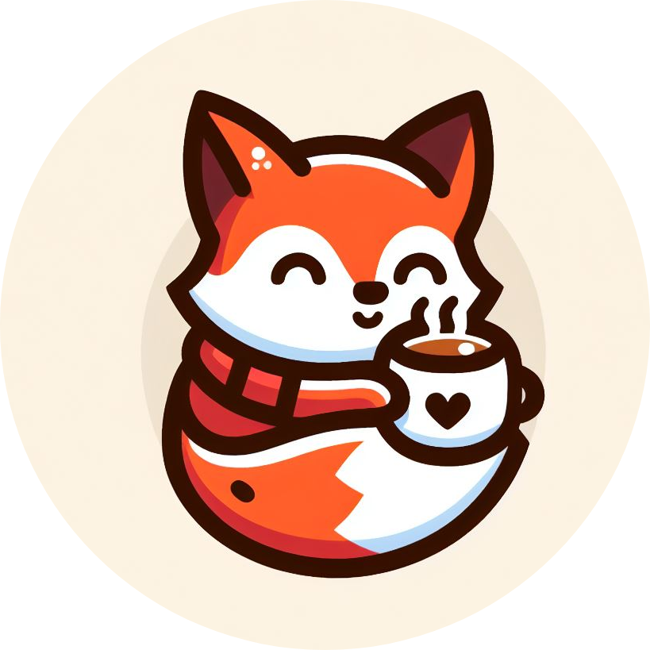

    
    <h1>Fox Coffee</h1>

Este Proyecto fue durante la cursada de Desarrollo Web de CoderHouse.

<h2>Estructura</h2>
<ul>
    <li>Página principal de introducción de la cafetería</li>
    <li>Página relatando historia de la cafetería</li>
    <li>Página exhibidora de los productos de la cafetería</li>
    <li>Página que denota las reseñas de distintos clientes de la cafetería</li>
    <li>Página que permite enviar un mensaje a la cafetería (No funcional)</li>
</ul>
<h3>Características Adicionales</h3>
<ul>
    <li>Todas las páginas deben mostrar la ubicación del local, su horario de atención</li>
    <li>Todas las páginas deben ser responsivas, adaptándose tanto para equipos de escritorio, como para tabletas y celulares</li>
</ul>
<h4>Tecnologías y Frameworks utilizados</h4>
<ul>
    <li>HTML</li>
    <li>CSS, SCSS</li>
    <li>Bootstrap</li>
    <li>Animate</li>
    <li>AOS</li>
</ul>

